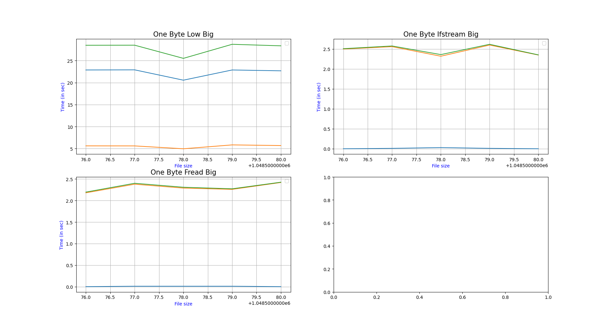

Для точности статистики имеет смысл делать измерения сразу на большом количестве файлов. Тогда меньшую долю занимают накладные
затраты не связанные конкретно с чтением и обработкой полученных данных. Кроме того, при увеличении количества файлов - случайные задержки
которые могут быть получены на конкретном файле вносят меньшую ошибку

Будем делать измерения на 100 файлах и для разных размеров и разных значений chunk
Построим три графика: для разных типов времен 
- внутренний замер (зеленый)
- утилиты time usr (синий)
- утилиты time sys (оранжевый)

Посмотрим на маленьких файлах сначала:

Видим, что в целом время работы очень маленькое (может быть подвержено погрешностям измерения)

Но в целом, если читать файл целиком сразу получается немного быстрее, кроме того время работы настолько маленькое, что не получается почти нигде из утилиты time достать разделение на пользовательское и системное время.

Посмотрим на чуть большие файлы:

Здесь уже более ясно видно, что читать по одному байту сильно медленней.
Кроме того видим, что если читать по одному байту c помощью read. Время работы сильно возрастает (по сравнению со всеми другими способами) И единственный способ получать существенные задержки в user space.

Кроме того, видим, что если брать chunk порядка size/10 - время работы по сравнению с полным файлом существенно не менятся - но так можно экономить память для подгрузки файла.

Посмотрим на замеры на больших файлах

На больших файлах, все замеченное на средних подтверждается - почти все затраченное время - системное. (как раз на системные вызовы чтения памяти)
Наблюдаемые скачки на графиках - можно объяснить тем - неоднородность данных - при большем числе запусков и более разнородных данных должны сглаживаться.

Наиболее эффективно использовать высокоуровневые методы (ifstream, fread), и для экономии памяти можно использовать чтение порциями примерно по size/10.

Информация об устройстве:

- Linux 5.13.0-39-generic x86_64
- CPU i5-11300H @ 3.10GHz
- SSD
- fs: ext4
- планировщик I/O: [none] mq-deadline